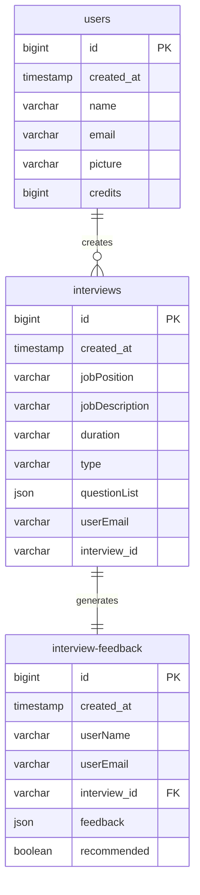

# 🧠 AI-Powered Recruitment Assistant

[](https://nextjs.org/)
[](https://supabase.io/)
[](https://openrouter.ai/)
[](https://vapi.ai)

An end-to-end full-stack AI interview assistant built with **Next.js**, **React**, **Tailwind CSS**, and **Supabase**. This SaaS-style platform allows recruiters to:

- ✅ Generate AI-driven interview questions  
- 🎤 Conduct real-time voice-based interviews via **Vapi**  
- 📄 Automatically generate structured AI feedback post-interview  

---

## 🔗 Live Demo  
(Deployed on Render) 👉 [Click here to try the app](https://ai-interviewer-3-3e6p.onrender.com/)

---
# 🧩 How It Works
## Interview Flow
sequenceDiagram
    Recruiter->>+Frontend: Create interview
    Frontend->>+OpenRouter: Generate questions
    OpenRouter-->>-Frontend: Question set
    Frontend->>+Vapi: Start voice call
    Vapi->>Candidate: Conduct interview
    Candidate->>Vapi: Responses
    Vapi-->>-Frontend: Transcript
    Frontend->>OpenRouter: Evaluate
    OpenRouter-->>Frontend: Feedback report

---
## 📈 Database Schema

### Entity Relationship Diagram



## ✨ Features

### 🤖 AI Interview Question Generator
- Input job role, description, duration, and interview type (technical/behavioral)
- Generates a tailored set of interview questions using **OpenRouter AI** models (e.g., Llama, Gemini, DeepSeek)

### 🎙️ Real-time Voice Interviews
- Conduct interviews using **Vapi Voice AI Agent**
- Natural two-way conversations with support for listening, repetition, and hints
- Tracks call events (start, end, response time) for UI feedback and logging

### 📊 AI-Generated Feedback
- Summarizes candidate performance post-interview
- Includes ratings, strengths, weaknesses, and hiring recommendations
- Uses prompt-engineered requests to OpenRouter for consistent outputs

### 🔐 Authentication and Backend
- Google authentication via **Supabase Auth**
- Backend storage using **Supabase PostgreSQL**
- Real-time updates and secure API access
- Clean database schema with interviews, users, and feedback relations

---

## 🧱 Tech Stack

| Frontend       | Backend        | AI & Voice        |
|----------------|----------------|-------------------|
| Next.js        | Supabase DB    | OpenRouter (AI)   |
| React          | Supabase Auth  | Vapi (Voice AI)   |
| Tailwind CSS v4|                |                   |
| Shadcn UI      |                |                   |

---

## 📷 Screenshots

| Landing Page | Interview Questions | Voice Interview |
|--------------|---------------------|-----------------|
|  |  |  |

---

## 🚀 Getting Started

### 1. Clone the Repository

```bash
git clone https://github.com/your-username/ai-recruiter-assistant.git
cd ai-recruiter-assistant
```

2. Install Dependencies
```bash
npm install
```
3. Create .env.local File
```bash
NEXT_PUBLIC_SUPABASE_URL=your_supabase_url
NEXT_PUBLIC_SUPABASE_ANON_KEY=your_anon_key
SUPABASE_SERVICE_ROLE_KEY=your_service_role_key
OPENROUTER_API_KEY=your_openrouter_api_key
VAPI_API_KEY=your_vapi_key
```
4. Run the Development Server
```bash
npm run dev

```

🙌 Contributing
Pull requests are welcome! For major changes, please open an issue first to discuss what you'd like to change.

